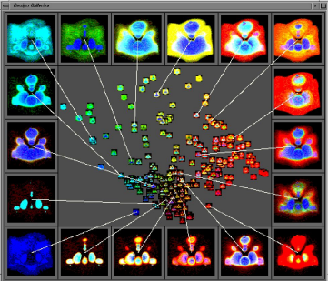

# Transfer Function Design Gallery

This project is part of course Advanced Computer Grpahics, Faculty of Computer and Information Science of the University of Ljubljana, May 2022.
Author: Jan Pelicon
Menthor: Žiga Lesar
Course holder: prof. dr. Matija Marolt

## Instructions

Creating and adjusting a transfer function for good visualization in volume rendering can be quite demanding. To
ease the process and bring the transfer function closer to the everyday user, your task is to develop an exploratory
tool which will allow users to easily create and adjust the transfer function for a specific dataset. The tool should
allow “browsing” through variations of the currently applied transfer function in a similar fashion to design galleries. 
The transfer function recommendations should be presented to the user in the form of small low-resolution
previews. The user should be able to adjust and fine-tune the resulting transfer function.



## Implementation

A design gallery is implemented as an extension in [VPT: The Volumetric Path Tracing Framework](https://github.com/terier/vpt). A backend is written in python using flask.

## Building and running

You need only `node` to build the framework and to run it.

```bash
bin/packer
bin/server-node
```

Backend of the design gallery must be running simultaneously. You need to install required python libraries and then run it. 

```bash
pip install -r requirements.txt
python server.py
```

You can test transfer function design gallery with a few demo volumes located in ./demo_volumes.

## License

This project is licensed under the **MIT License**.
See [LICENSE](LICENSE) for details.